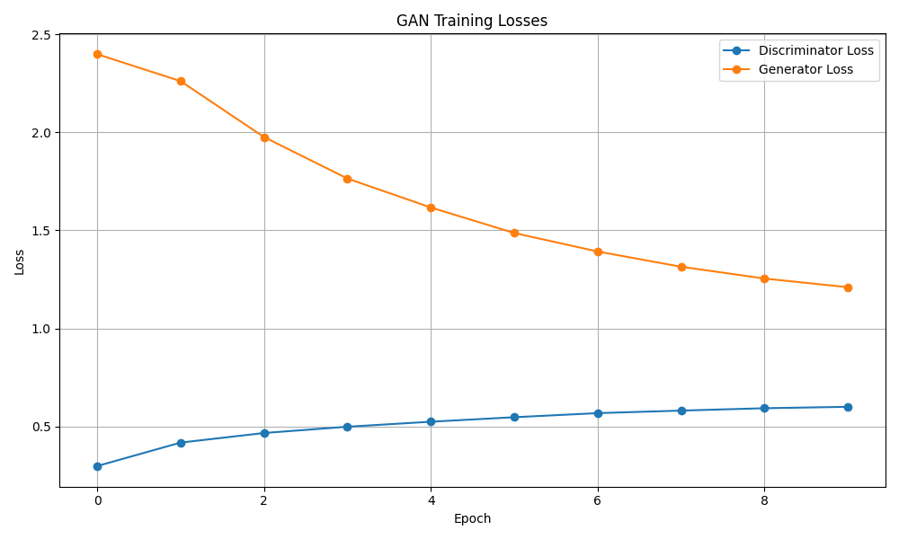
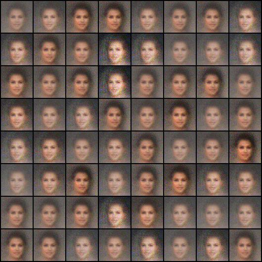
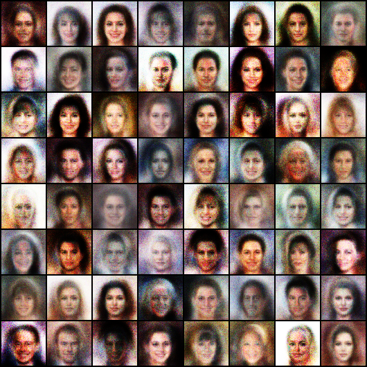
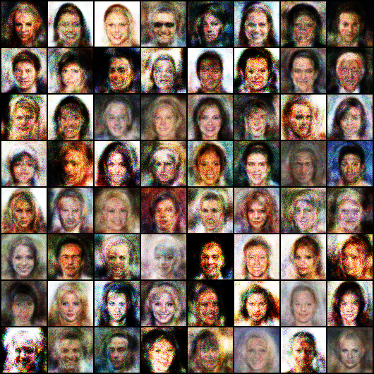

# Face Creation using GAN

## Overview

This project is made in the IPSSI student context to learn how GAN and image generation work. 
The main objective is to learn to create a GAN model from scratch.

---

## Project Structure

### Classes Explanation

| Class | File | Description |
|-------|------|-------------|
| **CelebDataset** | `CelebDataset.py` | The class that transforms and handles my dataset |
| **Generator** | `Generator.py` | The class that will generate images |
| **Discriminator** | `Discriminator.py` | The class that is trained to be able to determine if the image is a fake one made by the generator or a real image |
| **FaceGenerator** | `FaceGenerator.py` | The class that contain mains methods for training loop, save models, save generated images |


---

### Folder

| Folder | Description |
|-------|------|
| **dataset** | Contain the dataset, not available in this repo, download at : [CelebFaces](https://www.kaggle.com/datasets/jessicali9530/celeba-dataset) |
| **ganClass** | Contain all the class of this project |
| **generated_images** | Image result after training |
| **saved_models** | Contain all trained model for each training epoch, kind of a backup |


---

## Getting Started

### Prerequisites

- Python >= 3.11
- UV package manager

### Installation

```bash
# Install dependencies
uv add torch torchvision pillow
```

---

```bash
## ONLY FOR GPU ##
# If GPU availabel install a torch version with CUDA 
 uv pip install torch torchvision torchaudio --index-url https://download.pytorch.org/whl/cu121
```

---

## How GAN Works

**GAN (Generative Adversarial Network)** consists of two antagonist neural networks:

1. **Generator** - Creates fake images
2. **Discriminator** - Distinguishes between real and fake images
2. **FaceGenerator** - Contain mains methods for training model


These two networks compete against each other, improving their performance over time.


## Courbes de perte



*Fichier : training_plots/losses.png*

Analyse : la perte du discriminateur augmente, ce qui indique qu'il devient plus difficile de différencier les images générées des images réelles, tandis que la perte du générateur diminue, montrant que la qualité des images générées s'améliore. La tendance semble s'améliorer puis se stabiliser autour de 15–20 epochs. Pour obtenir de meilleures performances, envisager des techniques avancées.


## Résultats
*Image générée après la première époque : on constate un bruit aléatoire important, les images sont très pixellisées.*



*Après 5 époques : les visages sont reconnaissables malgré un flou persistant.*



*Après 10-20 époques : les traits sont plus nets et la symétrie des visages s'améliore ; le bruit persiste mais est légèrement atténué.*



